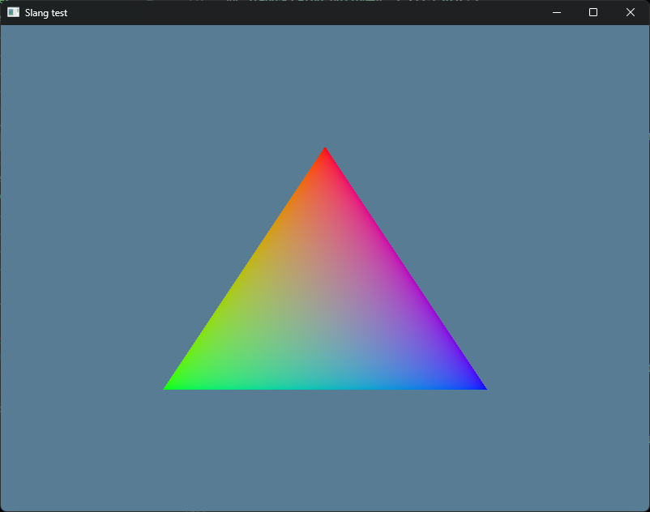

# Hello Slang Vulkan ash Zenn

Zennの記事用のサンプルリポジトリです。

[シェーダー言語のSlangをRustとVulkan (ash)で試してみる - Zenn](https://zenn.dev/matcha_choco010/articles/2025-03-29-hello-slang-vulkan-ash)

RustのVulkanバインディングのashとSlangを使って三角形を表示します。
Slangのコンパイルをbuild.rs内で行っています。

## 使い方

1. Vulkan SDKをインストールしてください。
2. `cargo run --release`を実行してください。
